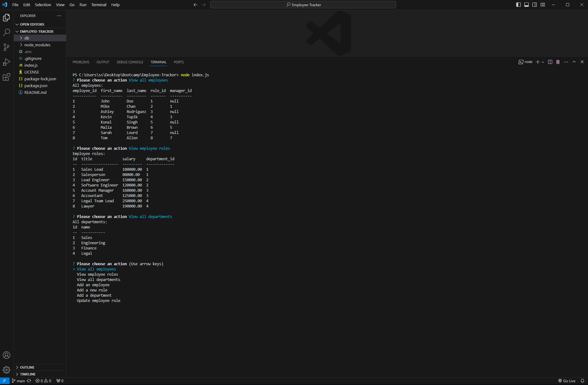

# SQL Employee Tracker

  
  ## Table of Contents

  - [Description](#description)
  - [Installation](#installation)
  - [Usage](#usage)
  - [Contributions](#contributions)
  - [Tests](#tests)
  - [License](#license)
  - [Questions](#questions)
  
  ## Description

  A command-line application to manage a company's employee database

  ## Installation
  
  This application will require an "npm i" to install dependancies, as well as MySQL where you can import the schema and seeds.

  ## Usage

  "node index.js" will satrt the appication, then you will follow the on screen instructions.

  ## Video Demo Link
  https://drive.google.com/file/d/1FgiVoAWItY8Oq3Qe66EGnITZ8Tel8ui2/view

  ## Contributions
  
  N/A

  ## Tests
  
  N/A
  

  ## License
  
  MIT
  

  ## Questions
  
  Have questions about this project? Contact me!
  Email me at: tshankgg@gmail.com,
  or find me on GitHub here: https://github.com/FirefoxFlareon
